# Berkeley Networking Tracker

A private networking tracker for the people you want to stay connected with at Berkeley. Each
person signs in with their own account and gets their own contact list — name, company, role,
where you met, notes, and a high/medium/low priority — which they can create, edit, delete, sort,
and filter. The interesting part of this project is not the CRUD; it is *where the rules live*.
The browser talks directly to a public Neon Data API endpoint, so every contacts row is reachable
over the network by anyone holding a valid token. What keeps User A out of User B's contacts is
not the React code — it is Row Level Security inside Postgres, and what stops an invalid priority
from being saved is a CHECK constraint, not a form. This README shows both, and includes a
scripted test that proves them by attacking the deployed app rather than by asserting they work.

**Live app: https://berkeley-networking-tracker-sigma.vercel.app**

**Repository: https://github.com/adelinemlalor/berkeley-networking-tracker**

---

## Contents

- [Try it yourself](#try-it-yourself)
- [Product walkthrough](#product-walkthrough)
- [Features](#features)
- [Technology stack, and why](#technology-stack-and-why)
- [Architecture](#architecture)
- [Database schema](#database-schema)
- [Authentication and RLS ownership](#authentication-and-rls-ownership)
- [Grading evidence](#grading-evidence)
- [Local setup](#local-setup)
- [Environment variables](#environment-variables)
- [Tests](#tests)
- [Deployment](#deployment)
- [Known limitations and what I would do next](#known-limitations-and-what-i-would-do-next)

---

## Try it yourself

Sign up with any email and password (8+ characters) — no email confirmation is required.

Two pre-made accounts exist so the privacy test can be reproduced without creating anything:

| Account | Email | Password |
|---|---|---|
| User A | `grader-a@berkeley-tracker.test` | `GraderTestA!2026` |
| User B | `grader-b@berkeley-tracker.test` | `GraderTestB!2026` |

Sign in as A, note the contacts. Sign out, sign in as B, and you will see a completely different
list. Neither account can reach the other's rows by any route — including going around the UI
entirely, which [the verification script](#2-two-account-privacy-test) does.

> These credentials are published deliberately, because reproducing the two-user test is a grading
> requirement. They are throwaway accounts on a demo app where every row is RLS-protected, so
> knowing them grants access to nothing but two lists of fictional people. No real secret is
> published anywhere in this repository.

---

## Product walkthrough

All screenshots below were captured from the **deployed production app** by
`npm run capture`, which drives a real browser through each flow. They can be regenerated at any
time, so they cannot drift away from what the app actually does.

### Signing in and signing out

| Sign in | Signed out again |
|---|---|
| 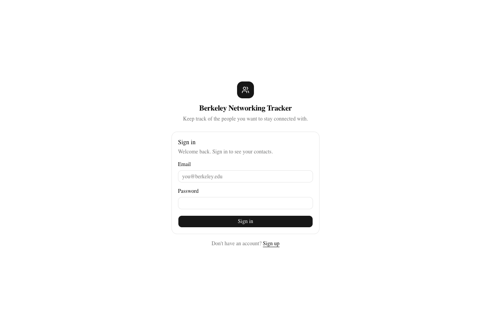 | 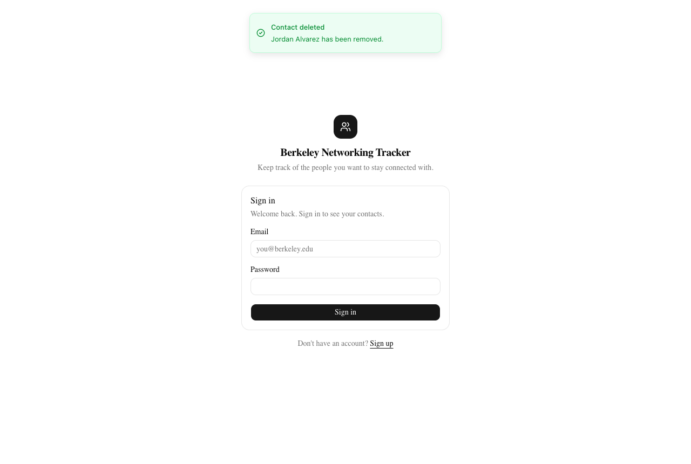 |

### The contact list

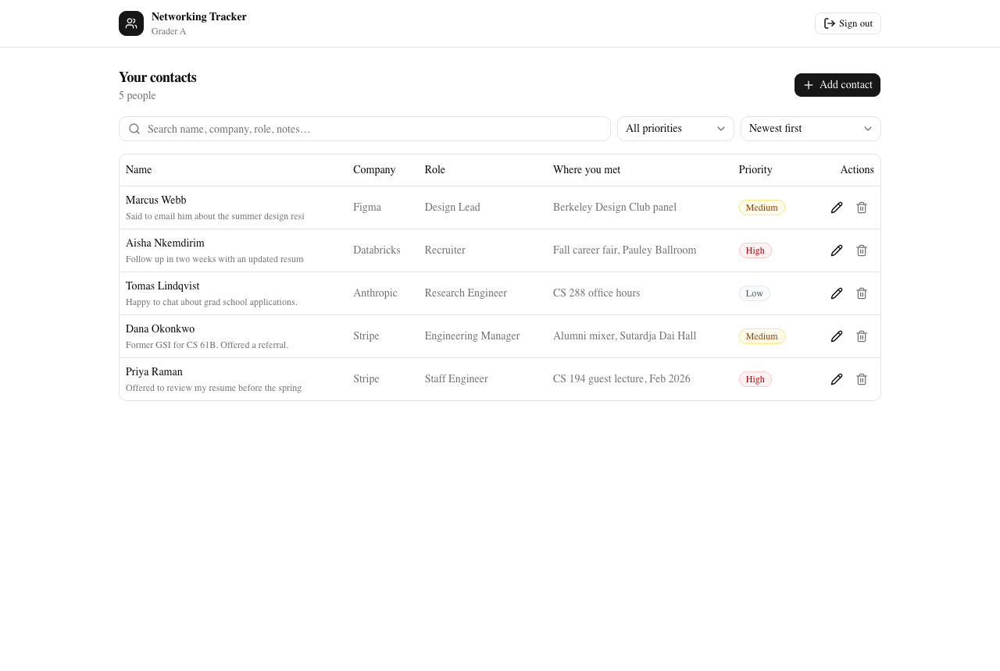

### Creating, editing, and deleting

| Create succeeds | Edit succeeds |
|---|---|
| 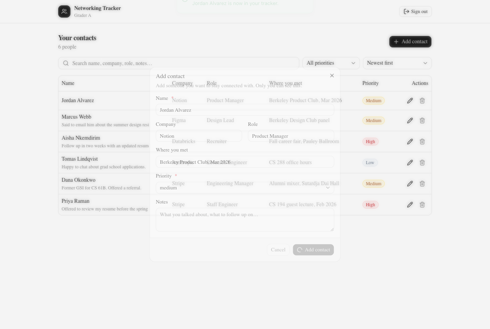 | 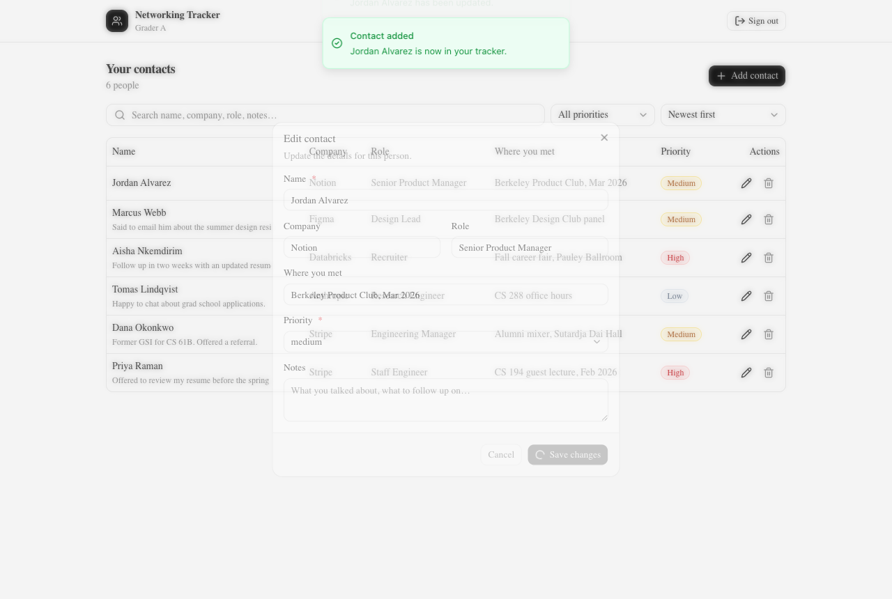 |

| Delete confirmation | Delete succeeds |
|---|---|
| 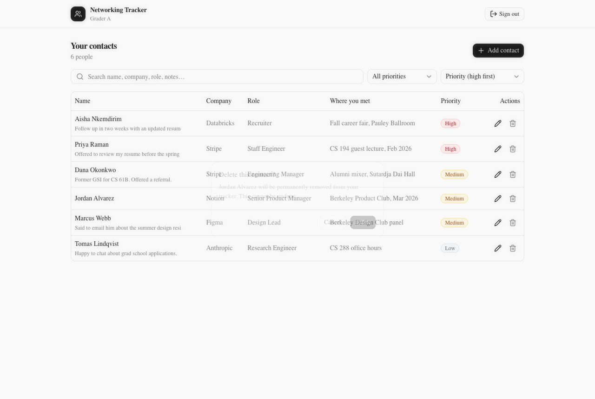 | 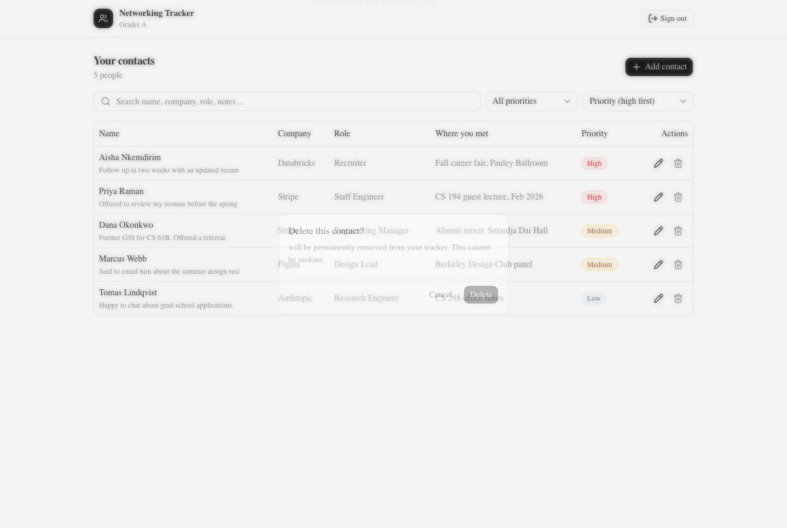 |

**Data survives a refresh**, because it lives in Neon Postgres rather than in browser state. This
screenshot is taken *after* a full page reload — the edit made in the previous step is still
there:

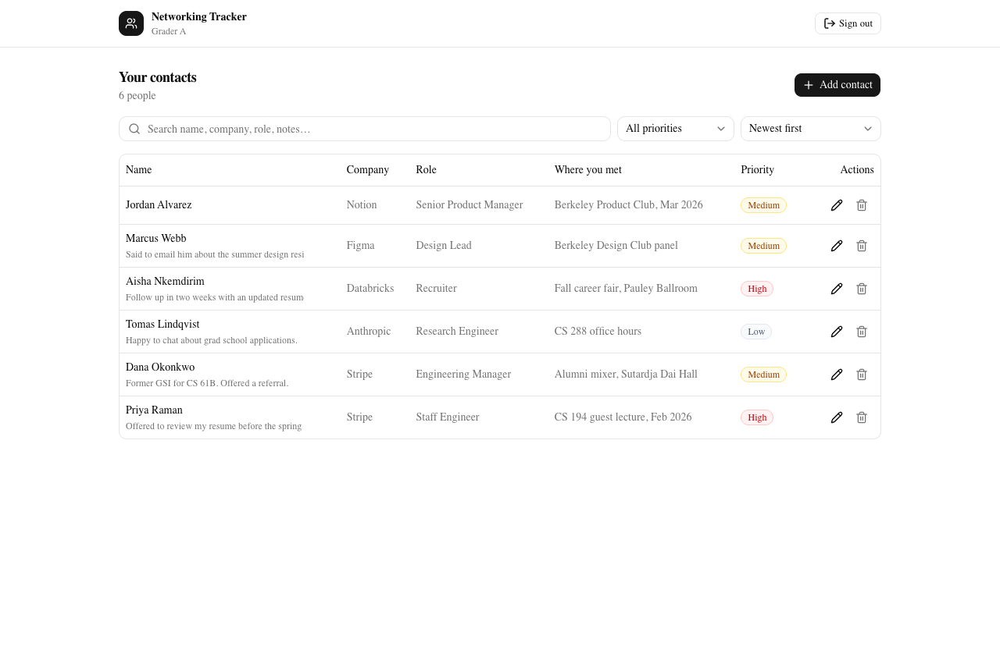

### Sorting and filtering

| Sorted by priority, high first | Filtered to high priority only |
|---|---|
| 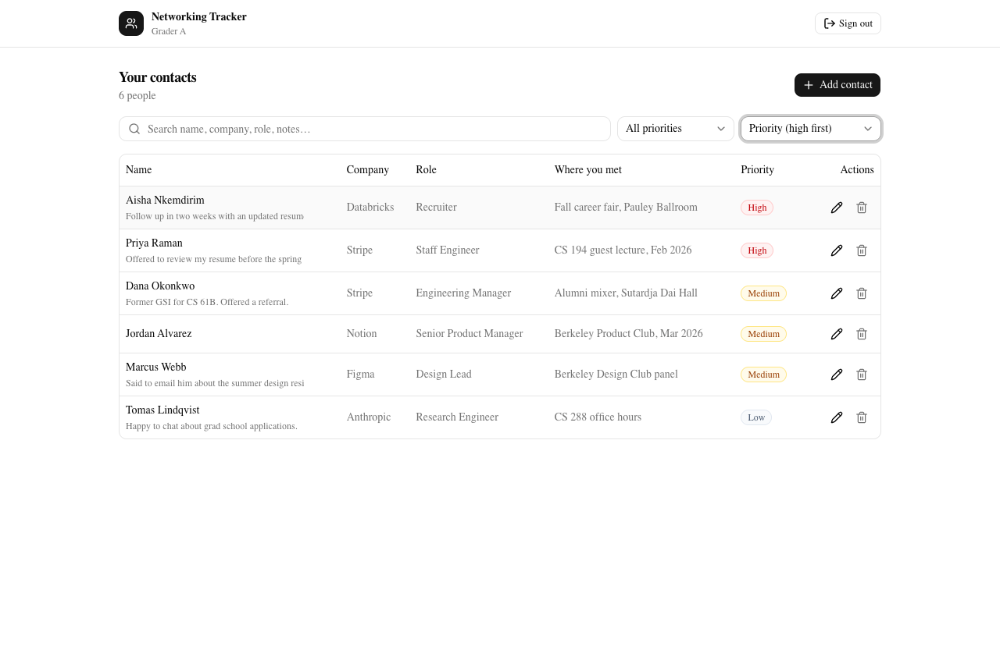 | 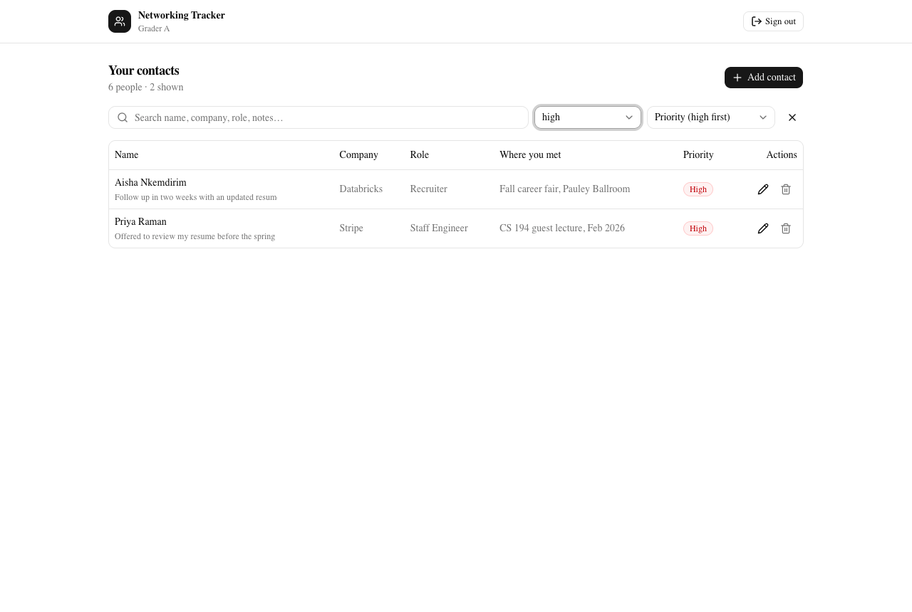 |

### Mobile

The table becomes cards below the `md` breakpoint, because a six-column table on a 390px screen
is unusable.

| Sign in (390px) | Contacts (390px) |
|---|---|
| 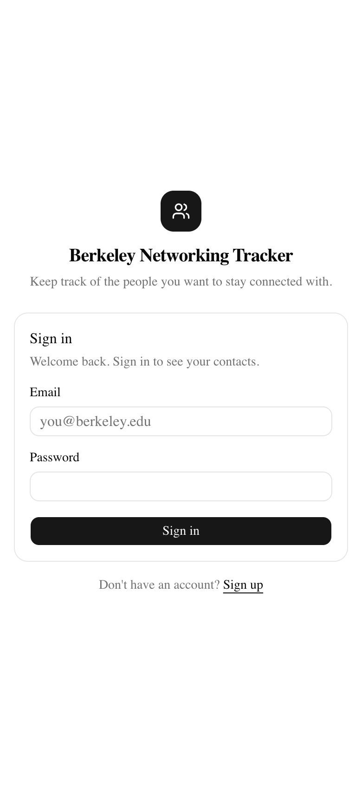 | 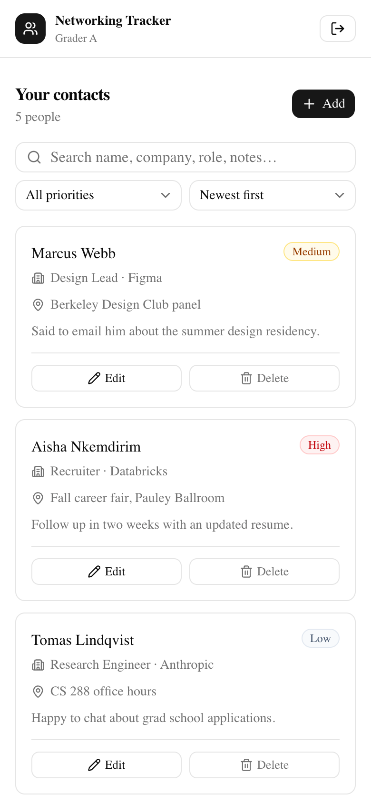 |

---

## Features

- **Accounts** — sign up, sign in, sign out, with the session surviving a page refresh.
- **Private contact lists** — each user sees only their own contacts, enforced in the database.
- **Full CRUD** — add, view, edit, and delete contacts.
- **Fields** — name (required), company, role, where you met, notes, and priority (required).
- **Priority** — accepts only `high`, `medium`, or `low`, enforced by a database CHECK constraint.
- **Sorting** — newest, oldest, name A–Z, name Z–A, priority high-first, priority low-first.
  Priority sorts by rank rather than alphabetically, and ties break by name so order is stable.
- **Filtering** — free-text search across name, company, role, where you met, and notes, plus a
  priority facet. Both can be combined.
- **All four UI states** — loading skeletons, two distinct empty states, success toasts, and
  errors shown inline per field or in a banner.
- **Responsive** — a table on desktop, cards on phones; verified at 390px.
- **Accessible** — labelled inputs, `aria-invalid` and `aria-describedby` wiring on errors,
  `role="alert"` on messages, and priority conveyed by text as well as colour.

---

## Technology stack, and why

| Layer | Choice | Why |
|---|---|---|
| Framework | **Next.js 16** (App Router, TypeScript) | Vercel-native, so deployment is one command. The App Router keeps routing separate from components, and TypeScript catches field-name mistakes between the schema, the repository layer, and the UI. |
| Styling | **Tailwind CSS v4 + shadcn/ui** | Satisfies the "design or component system" requirement. shadcn/ui is built on Radix primitives, so the dialog, select, and alert-dialog come with focus trapping and keyboard support already correct; the components are copied into `src/components/ui/` so they can be read and modified rather than being an opaque dependency. |
| Auth | **Neon Managed Better Auth** | Required. Identity lives in the same Postgres instance as the data, which is what makes `auth.user_id()` usable directly inside RLS policies. |
| Data access | **Neon Data API** via `@neondatabase/neon-js` | Required. A PostgREST-compatible HTTP API that forwards the caller's JWT into Postgres, so the database — not the app — decides what each request may see. |
| Database | **Neon Postgres 18** | Required. RLS and CHECK constraints are the actual security and validation layers of this project. |
| Tests | **Vitest** | Fast, TypeScript-native, no configuration beyond a path alias. The default suite runs with no environment variables, so a grader can clone and test immediately. |
| Screenshots | **playwright-core** | Drives the Chrome already on the machine (downloads no browser) so the README's evidence is scripted and reproducible rather than hand-taken. |
| Hosting | **Vercel** | Required. |

---

## Architecture

```
┌────────────────────────────────────────────────┐
│  FRONTEND — Next.js client bundle (Vercel CDN)  │
│                                                │
│  src/app/page.tsx        session gate          │
│  src/components/*        rendering only        │
│  src/lib/contact-schema  UX validation only    │
│  src/lib/contacts-repo   HTTP calls            │
│                                                │
│  Holds: a JWT.  Holds no database credential.  │
└───────────────┬────────────────────────────────┘
                │  HTTPS + Authorization: Bearer <JWT>
                │  (the trust boundary)
    ┌───────────┴────────────┬───────────────────────────┐
    ▼                        ▼                           │
┌─────────────────────┐  ┌──────────────────────────┐    │
│ Neon Managed        │  │ Neon Data API            │    │
│ Better Auth         │  │ (PostgREST)              │    │
│                     │  │                          │    │
│ sign-up / sign-in   │  │ verifies the JWT, opens  │    │
│ issues the JWT      │  │ a connection as the      │    │
│ (sub = user id)     │  │ `authenticated` role     │    │
└─────────────────────┘  └────────────┬─────────────┘    │
                                      ▼                  │
                    ┌──────────────────────────────────┐ │
                    │  BACKEND — Neon Postgres 18      │ │
                    │                                  │ │
                    │  RLS policies  → who sees what   │ │
                    │  CHECK constraints → what is     │ │
                    │                      valid       │ │
                    │  set_updated_at() trigger        │ │
                    │  column-level UPDATE grants      │ │
                    └──────────────────────────────────┘ │
                                                         │
   Nothing in the frontend can reach past this boundary ──┘
```

### Frontend and backend are genuinely separated

This is a listed requirement, and it is worth stating explicitly rather than leaving it to be
inferred, because there is no `server.js` in this repository.

- **The frontend** is the Next.js client bundle. It renders, it validates for immediate feedback,
  and it holds a JWT. It contains no database credential and no privileged code path. Everything
  in it is visible to anyone who opens devtools — and that is fine, by design.
- **The backend** is the Neon Data API together with the constraints, trigger, grants, and RLS
  policies defined in [`db/migrations/0001_contacts.sql`](db/migrations/0001_contacts.sql). This
  tier authenticates every request by verifying the JWT signature, decides which rows exist for
  that identity, and rejects invalid writes.
- **The boundary between them** is an HTTPS request carrying a bearer token. The two tiers deploy
  separately, share no memory, and communicate only over that wire. The frontend cannot reach past
  it: `contacts` is granted to the `authenticated` role only, and every policy re-derives identity
  server-side from the verified token via `auth.user_id()` rather than trusting any field the
  client sends.

The honest converse: this design has **no custom Node backend, on purpose**. Adding a Next.js
route handler that proxied these same queries would not improve security by one inch, because none
of the enforcement was ever written in JavaScript. It would only move the same HTTP call one hop
later and give a reader the false impression that the server code was what protected the data. The
assignment asks for validation in "trusted server or database code"; this project chooses the
database, which is the layer a hostile client genuinely cannot skip.

### Request flow for "add a contact"

1. The user submits the dialog. `validateContact()` runs in the browser and, if anything is wrong,
   renders a message next to the offending field. Nothing is sent.
2. If it passes, `createContact()` POSTs to `…/rest/v1/contacts`. It **does not send `user_id`** —
   ownership is not the client's business.
3. The Data API verifies the JWT against Neon Auth's JWKS and opens a Postgres connection as the
   `authenticated` role with the token's claims attached.
4. Postgres fills `user_id` from its `DEFAULT auth.user_id()`, then checks the row against the
   INSERT policy's `WITH CHECK` and the CHECK constraints.
5. Either the row is written and returned, or an error comes back. `mapDbError()` translates
   constraint names into readable messages, so the UI reports the real reason even for a rule the
   client never checked.

---

## Database schema

Defined in [`db/migrations/0001_contacts.sql`](db/migrations/0001_contacts.sql), which is
idempotent and doubles as a from-scratch setup script.

### `public.contacts`

| Column | Type | Null? | Default | Notes |
|---|---|---|---|---|
| `id` | `uuid` | not null | `gen_random_uuid()` | Primary key. |
| `user_id` | `text` | **not null** | **`auth.user_id()`** | Owner. Taken from the verified JWT, never from client input. |
| `name` | `text` | not null | — | Required. Must be non-blank after trimming; max 120 chars. |
| `company` | `text` | null | — | Optional; max 120 chars. |
| `role` | `text` | null | — | Optional; max 120 chars. |
| `met_at` | `text` | null | — | Where they met. Optional; max 200 chars. |
| `notes` | `text` | null | — | Optional; max 2000 chars. |
| `priority` | `text` | not null | `'medium'` | Must be exactly `high`, `medium`, or `low`. |
| `created_at` | `timestamptz` | not null | `now()` | |
| `updated_at` | `timestamptz` | not null | `now()` | Maintained by a `BEFORE UPDATE` trigger so it cannot be back-dated by a client. |

Index: `contacts_user_created_idx` on `(user_id, created_at desc)` — the shape of every query the
app makes.

### Validation constraints (the trusted layer)

```sql
constraint contacts_name_not_blank  check (length(btrim(name)) > 0),
constraint contacts_name_max_len    check (length(name) <= 120),
constraint contacts_priority_valid  check (priority in ('high', 'medium', 'low')),
constraint contacts_company_max_len check (company is null or length(company) <= 120),
constraint contacts_role_max_len    check (role    is null or length(role)    <= 120),
constraint contacts_met_at_max_len  check (met_at  is null or length(met_at)  <= 200),
constraint contacts_notes_max_len   check (notes   is null or length(notes)   <= 2000)
```

`src/lib/contact-schema.ts` mirrors these limits exactly for instant in-form feedback. The SQL is
the source of truth; if one changes, both must.

---

## Authentication and RLS ownership

### How identity reaches the database

Neon Managed Better Auth issues a signed JWT whose `sub` claim is the user's id and whose `role`
claim is `authenticated`. The Data API verifies that signature against Neon Auth's JWKS endpoint
on every request, then opens the Postgres connection as the `authenticated` role with the claims
in scope. Inside a policy, `auth.user_id()` reads `sub` out of that verified token.

The consequence that matters: **a client cannot influence what `auth.user_id()` returns** without
forging a signature. Ownership is therefore not something the app asserts — it is something the
database derives.

### The ownership rule

Every policy expresses the same rule, `auth.user_id() = user_id`, applied to each operation
separately:

```sql
alter table public.contacts enable row level security;
alter table public.contacts force  row level security;   -- applies to the table owner too

create policy contacts_select_own on public.contacts
  for select to authenticated using ((select auth.user_id()) = user_id);

create policy contacts_insert_own on public.contacts
  for insert to authenticated with check ((select auth.user_id()) = user_id);

create policy contacts_update_own on public.contacts
  for update to authenticated
  using      ((select auth.user_id()) = user_id)   -- which rows you may target
  with check ((select auth.user_id()) = user_id);  -- what they may look like afterwards

create policy contacts_delete_own on public.contacts
  for delete to authenticated using ((select auth.user_id()) = user_id);
```

Three details worth calling out:

1. **`USING` versus `WITH CHECK` on UPDATE.** `USING` decides which rows you are allowed to touch;
   `WITH CHECK` re-validates the row *after* your edit is applied. Without `WITH CHECK`, a user
   could take one of their own rows and rewrite `user_id` to someone else's id — handing a row
   away, or planting one in another user's list. With it, the post-edit row must still belong to
   you, so that write is rejected.
2. **Grants matter as much as policies.** RLS filters rows, but a grant decides whether you may
   attempt the operation at all. `contacts` is granted to `authenticated` only — the `anonymous`
   role has everything revoked, so signed-out callers get nothing. As defense in depth, `UPDATE`
   is granted *per column* (`name, company, role, met_at, notes, priority`), so an attempt to
   rewrite `id`, `user_id`, or the timestamps is refused by the privilege system before RLS is
   even consulted:

   ```
   PATCH /contacts?id=eq.<my own row>   {"user_id": "<user B's id>"}
   → 42501  permission denied for table contacts
   ```

   There is a trap here worth recording. Enabling the Data API with default grants gives
   `authenticated` a **table-wide** `UPDATE` privilege, and a table-level grant subsumes any
   column-level one — so adding the column grant on its own silently restricts nothing, and the
   configuration *looks* right while doing nothing. The migration therefore revokes the
   table-level `UPDATE` first and only then grants the six editable columns. I caught this by
   querying `information_schema.column_privileges` rather than trusting that the `GRANT` I wrote
   had the effect I intended.

   Note that the ownership guarantee never depended on this: with the column grant absent, the
   same attempt is still rejected by the UPDATE policy's `WITH CHECK`. The grant is a second
   lock on the same door, and it fails earlier and more cheaply.
3. **`FORCE ROW LEVEL SECURITY`.** By default a table's owner bypasses RLS. Forcing it means even
   an owner-role connection is subject to the policies, so there is no quiet back door.

---

## Grading evidence

### 1. Automated tests pass

```
$ npm test

 ✓ tests/contact-schema.test.ts > validateContact — name > rejects an empty name
 ✓ tests/contact-schema.test.ts > validateContact — name > rejects a whitespace-only name, matching the DB btrim check
 ✓ tests/contact-schema.test.ts > validateContact — priority > rejects the invalid priority 'urgent'
 ✓ tests/contact-schema.test.ts > validateContact — priority > accepts the valid priority high
 …

 Test Files  2 passed (2)
      Tests  45 passed (45)
```

Full output: [`docs/evidence/test-output.txt`](docs/evidence/test-output.txt).

### 2. Two-account privacy test

`npm run verify:rls` signs in as both users and drives the **public production Data API** exactly
as the browser does — same URL, same bearer token, with the app's client-side validation bypassed
entirely — then tries, on purpose, to do everything a malicious client would try.

```
User A  grader-a@berkeley-tracker.test  id=e136b101-a1e3-4385-b35e-984a43a41210
User B  grader-b@berkeley-tracker.test  id=1abacca4-dfe2-42d2-8b3b-004ac5f6f9f7

RLS / trusted-validation checks
---------------------------------------------------------------------------------
PASS  user_id defaults to the JWT identity, not client input                   row.user_id=e136b101-a1e3-4385-b35e-984a43a41210
PASS  A's contact list contains none of B's rows                               6 rows returned, 0 foreign
PASS  A cannot read B's row even by exact id                                   returned 0 rows
PASS  A cannot update B's row (0 rows affected)                                affected 0 rows
PASS  A cannot delete B's row (0 rows affected)                                affected 0 rows
PASS  A cannot insert a row owned by B (insert WITH CHECK)                     HTTP 403 42501
PASS  A cannot change its row's owner to B (update WITH CHECK + column grant)  HTTP 403 42501
PASS  priority 'urgent' rejected by the database, not the UI                   HTTP 400 new row for relation "contacts" violates check constraint "contacts_priority_valid"
PASS  blank name rejected by the database, not the UI                          HTTP 400 new row for relation "contacts" violates check constraint "contacts_name_not_blank"
PASS  B's row is untouched after all of A's attempts                           name=B private contact
---------------------------------------------------------------------------------
10/10 checks passed
```

Saved output: [`docs/evidence/rls-verification.txt`](docs/evidence/rls-verification.txt).
Script: [`scripts/verify-rls.mjs`](scripts/verify-rls.mjs).

Visually, the same isolation — User B signed in, seeing only User B's contacts, none of the five
belonging to User A shown earlier:

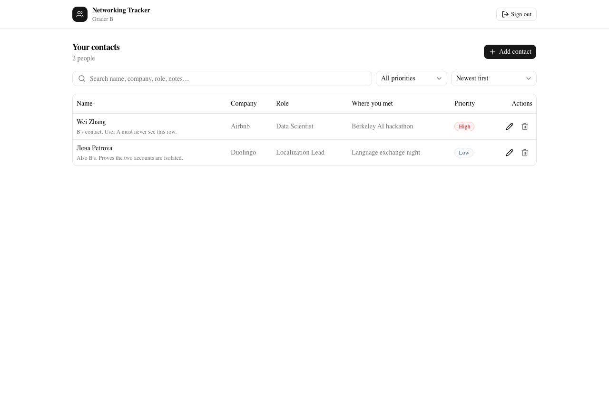

### 3. Invalid input fails safely

In the UI, a blank name is refused with an inline message and nothing is written:

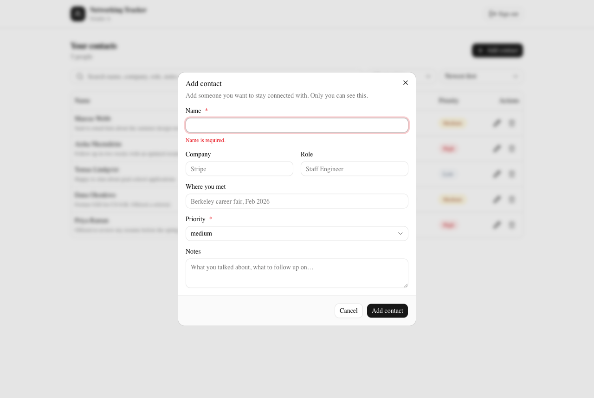

And when the UI is bypassed completely, Postgres refuses the same write itself — this is the check
that matters, because it is the one an attacker cannot skip:

```
$ curl -X POST "$NEON_DATA_API_URL/contacts" \
    -H "Authorization: Bearer $JWT" -H 'Content-Type: application/json' \
    -d '{"name":"Bad priority","priority":"urgent"}'

{"code":"23514",
 "message":"new row for relation \"contacts\" violates check constraint \"contacts_priority_valid\""}
```

### 4. No secrets in the repository

- `.env.local` is git-ignored; only `.env.example`, containing placeholders, is committed.
- `DATABASE_URL` is never imported by application code — only by `scripts/migrate.mjs` and
  `scripts/verify-rls.mjs`, which run locally.
- Vercel holds exactly two environment variables, both `NEXT_PUBLIC_` HTTPS endpoints. No
  connection string or cookie secret was ever added to the deployment.
- Verify for yourself against the full history:

  ```bash
  git log -p --all | grep -Ei 'npg_|neondb_owner:|postgresql://' || echo "no secrets found"
  ```

---

## Local setup

**Prerequisites:** Node.js 20+ and a Neon account.

```bash
# 1. Clone
git clone https://github.com/adelinemlalor/berkeley-networking-tracker.git
cd berkeley-networking-tracker

# 2. Install
npm install

# 3. Configure
cp .env.example .env.local
```

Then fill in `.env.local`. In the [Neon console](https://console.neon.tech), create a project and
enable both **Neon Auth** (provider: Better Auth) and the **Data API** on your default branch.
Copy the Auth URL and the Data API URL into the two `NEXT_PUBLIC_` variables, and the Postgres
connection string into `DATABASE_URL`.

```bash
# 4. Create the schema, RLS policies, and grants
npm run db:migrate

# 5. Run
npm run dev
```

Open <http://localhost:3000> and sign up.

> **If the app loads but every request fails with `relation "public.contacts" does not exist`,**
> the Data API's schema cache is stale. It caches the schema independently of Postgres, so a table
> that `psql` can see may still be invisible over HTTP. `npm run db:migrate` issues
> `NOTIFY pgrst, 'reload schema'` automatically for exactly this reason; if you applied SQL by
> hand, run that statement yourself.

---

## Environment variables

Names only — see [`.env.example`](.env.example) for the committed template with placeholders.

### Public (compiled into the browser bundle)

| Variable | Purpose |
|---|---|
| `NEXT_PUBLIC_NEON_AUTH_URL` | Neon Managed Better Auth HTTPS endpoint. |
| `NEXT_PUBLIC_NEON_DATA_API_URL` | Neon Data API HTTPS endpoint. |

These are addresses, not credentials, and exposing them is safe *because* of RLS: every row they
can reach is filtered to the signed-in user by the database.

### Server-only (never `NEXT_PUBLIC_`, never committed, never added to Vercel)

| Variable | Purpose |
|---|---|
| `DATABASE_URL` | Direct Postgres connection. Used only by `npm run db:migrate` locally. |

The deployed application never uses `DATABASE_URL`. This implementation also does not use
`NEON_AUTH_BASE_URL` or `NEON_AUTH_COOKIE_SECRET`: authentication happens against the public HTTPS
auth endpoint through `@neondatabase/neon-js`, so there is no server-side cookie session to sign.
They are listed in `.env.example` only for completeness.

### Optional, local only

`TEST_USER_A_EMAIL`, `TEST_USER_A_PASSWORD`, `TEST_USER_B_EMAIL`, `TEST_USER_B_PASSWORD` — used by
`npm run verify:rls` and `npm run capture`.

---

## Tests

```bash
npm test
```

**45 tests, no environment variables required** — clone, `npm install`, `npm test` works
immediately.

`tests/contact-schema.test.ts` covers the validation rules the assignment calls out:

- an empty name is rejected;
- a whitespace-only name is rejected, matching the database's `btrim` check;
- a missing name is rejected;
- a name over 120 characters is rejected, and exactly 120 is accepted;
- all three valid priorities are accepted;
- every invalid priority — `urgent`, `HIGH`, `critical`, `''`, `none`, `1` — is rejected;
- blank optional fields normalise to `NULL` rather than `''`;
- every invalid field is reported at once, keyed to its input;
- junk input (`null`, numbers, arrays) is rejected without throwing.

`tests/filter-sort.test.ts` covers search, the priority facet, all six sort orders, that priority
sorts by rank rather than alphabetically, that ties break by name, and that sorting never mutates
its input.

These test the *convenience* layer. The *trusted* layer is tested separately, against the live
database, by `npm run verify:rls` — see [Grading evidence](#2-two-account-privacy-test).

Other commands:

| Command | What it does |
|---|---|
| `npm run dev` | Start the dev server. |
| `npm run build` | Production build. |
| `npm run lint` | ESLint. |
| `npm run db:migrate` | Apply `db/migrations/*.sql`, then reload the Data API schema cache. |
| `npm run verify:rls` | Two-account privacy and trusted-validation proof. |
| `npm run capture` | Regenerate `docs/screenshots/`. Add `BASE_URL=…` to point at production. |

---

## Deployment

Deployed with the Vercel CLI:

```bash
npm i -g vercel
vercel link

# NEXT_PUBLIC_ values are inlined at build time, so they must exist before deploying.
vercel env add NEXT_PUBLIC_NEON_AUTH_URL production
vercel env add NEXT_PUBLIC_NEON_DATA_API_URL production

vercel deploy --prod
```

Then — and this step is easy to miss — **add the deployed domain to Neon Auth's trusted domains**,
or sign-in will fail in production with a `MISSING_ORIGIN` / untrusted-origin error even though it
works locally. In the Neon console: *Auth → Configuration → Trusted domains*, add
`https://your-app.vercel.app`.

Finally, verify against production rather than assuming:

```bash
BASE_URL=https://your-app.vercel.app npm run capture
VERIFY_ORIGIN=https://your-app.vercel.app npm run verify:rls
```

Both were run against this deployment; their output is the evidence above.

Only the two `NEXT_PUBLIC_` variables are set in Vercel. `DATABASE_URL` is deliberately absent —
the deployed app has no use for it, so it is not there to leak.

---

## Known limitations and what I would do next

**Limitations**

- **No email verification or password reset.** Better Auth supports both, but neither is wired up,
  so a typo'd email cannot be recovered.
- **Filtering and sorting happen in the browser.** All of a user's contacts are fetched once and
  narrowed client-side. That is instant and correct for a personal contact list, but at a few
  thousand rows the initial fetch would need pagination and server-side ordering. RLS is unaffected
  either way — the database still only ever sends the caller their own rows.
- **No optimistic concurrency.** Two tabs editing the same contact will let the last write win
  silently. A version column checked on update would fix this.
- **The client-side Zod schema duplicates the CHECK constraints.** Two definitions can drift.
  Generating one from the other, or a test that asserts the limits match, would close the gap.
- **`@neondatabase/neon-js` is at `0.7.0-beta`,** so it is pinned to an exact version. Its API may
  change before 1.0.
- **The Vercel project is not linked to GitHub;** `vercel git connect` failed because the Vercel
  GitHub app is not installed on the account. Deploys are run with `vercel deploy --prod` instead,
  which is why the repo has no deployment badge.
- **Screenshot capture reuses the machine's Chrome** via `playwright-core`, so `npm run capture`
  needs Chrome installed. Tests do not.

**What I would do next**

1. Add a `last_contacted` date and a "needs follow-up" view — the reason to keep this list at all
   is to act on it, and right now nothing surfaces who has gone cold.
2. Tags, so contacts can be grouped by class, club, or company independently of priority.
3. Server-side pagination, search, and ordering once the list is large enough to warrant it.
4. Run `verify:rls` in CI against a Neon preview branch, so a future migration that weakens a
   policy fails the build rather than shipping.
5. Component tests for the dialog with Testing Library, covering the keyboard path through the
   form.
